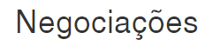

  

### This is a study project only and was developed following the Advanced JavaScript course from Alura :books:

## :electric_plug: Built With

- Frontend
  - JavaScript ES6
  - HTML5
  - CSS3
  - Bootstrap
  - FetchAPI
  - Babel

- Backend
  - provided by Alura

  

### <a href="https://cursos.alura.com.br/user/stefanosaffran">My profile on Alura</a> | <a href="https://www.linkedin.com/in/stefanosaffran/">LinkedIn</a> | <a href="https://stefanosaffran.com">Website</a>